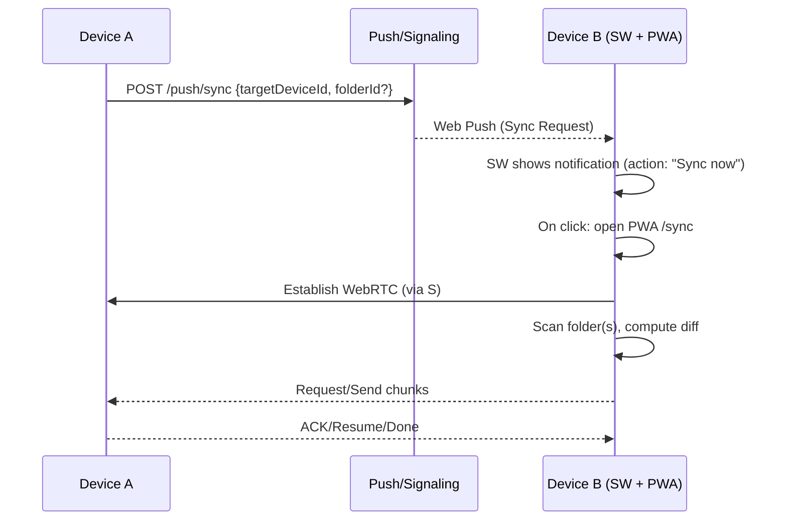

# Architecture — P2P Folder & File Sync

## 1. High‑Level Components
- **PWA (React+TS)**: UI, folder picking (where supported), scanning, diffing, transfers, notifications.
- **Service Worker**: Push handler, notification actions, offline shell, caching.
- **Sync Engine** (client‑side): Index store, diff engine, chunking/resume, E2EE, transfer orchestration.
- **Signaling & Push Service (Go)**: WebSocket signaling for WebRTC SDP/ICE exchange; VAPID Web Push; device registry (sqlc).
- **NAT Traversal**: STUN/TURN (coturn). Short‑lived credentials.
- **(Optional)** Desktop Helper (later): native watcher + local API to the PWA for non‑Chromium and deeper FS events.

## 2. Sequence — Pairing via QR
```mermaid
sequenceDiagram
    participant A as Device A (PWA)
    participant S as Signaling Server (Go)
    participant B as Device B (PWA)

    A->>A: Generate keypair (ECDH), deviceId = hash(pubKey)
    A->>A: Show QR: {deviceId, pubKeyJwk, signalingURL, iceServers}
    B->>B: Scan QR → parse payload
    B->>S: Open WS room (pairingId)
    A->>S: Open WS room (pairingId)
    A->>B: SDP Offer via S (WS)
    B->>A: SDP Answer via S
    A<->>B: ICE candidates via S
    A<->>B: Verify fingerprints (safety words)
    A-->>B: Secure DataChannel established (E2EE at app layer)
```

## 3. Sequence — Push‑to‑Sync


## 4. Client Architecture (PWA)
**UI**: HeroUI components; progress‑first design.

**State (Zustand)**
```ts
type Device = { id:string; name:string; pubKeyJwk:JsonWebKey; lastSeen?:number };
type FolderMapping = { id:string; name:string; handle?:FileSystemDirectoryHandle; include?:string[]; exclude?:string[] };
type Transfer = { id:string; deviceId:string; path:string; size:number; sentBytes:number; receivedBytes:number; status:'idle'|'sending'|'receiving'|'done'|'error' };
```

**React Query**: server calls (register device, subscribe push, create pairing room, TURN creds).

**Storage**
- **Preferred (Chromium)**: `showDirectoryPicker()`; persisted `FileSystemDirectoryHandle` permissions.
- **Fallback**: OPFS (Origin Private File System) as cache; manual import/export for non‑Chromium.
- **Index** in IndexedDB/OPFS: records `{ path, size, mtime, hash? }`.
- **Hashes**: whole‑file for small; chunked (1–4 MiB) for large.

**Transfers**
- WebRTC DataChannels: `control` (reliable/ordered) and `file` (reliable/ordered; unordered optional for metadata).
- Backpressure with `bufferedAmountLowThreshold` and drains.
- **Resume**: bitmap of received chunks; periodic checkpoints.

**Notifications**
- Web Push + Service Worker. (iOS requires Home‑Screen install.)
- Actions: “Sync now”, “Open app”.

**Pairing**
- **QR (default)**: `{version, deviceId, pubKeyJwk, signalingURL, iceServers}`.
- **BLE (optional)**: GATT bootstrap (Chromium‑only, feature‑flagged).

## 5. Security Model
- **Identity**: Per‑device ECDH keypair (P‑256). `deviceId = SHA‑256(publicKeyJwk)`.
- **Session**: ECDH → HKDF → AES‑GCM(256) per session/channel.
- **Files**: Per‑file symmetric key; per‑chunk (nonce, tag). Authenticated manifest of chunk MACs.
- **Verification**: Safety words (fingerprints) on both devices after handshake.
- **Server boundary**: Device IDs, push endpoints, SDP/ICE only; no file data.
- **Key backup**: Optional encrypted export (user passphrase). No server escrow.

## 6. Backend (Go + sqlc)
**Endpoints**
- `POST /api/devices` — register/upsert device
- `POST /api/push/subscribe` — store Web Push subscription
- `POST /api/push/sync` — send sync push
- `WS /ws/signaling/:roomId` — exchange SDP/ICE
- `GET /api/turn-cred` — short‑lived TURN credentials

**Schema (sketch)**
- `devices(id, name, pubkey_jwk, created_at)`
- `push_subscriptions(id, device_id, endpoint, key_p256dh, key_auth, created_at)`
- `pairings(id, a_device_id, b_device_id, created_at)`

**Infra**
- **coturn** in ≥2 regions (UDP 3478 + TCP 443).
- TLS; HSTS; CSP; COOP/COEP; Permissions‑Policy.

## 7. Diff & Conflict Strategy
- Diff by `(path, size, mtime)`; small files hash; large files chunk‑hash.
- Conflicts: default newer‑wins; optional keep‑both (`filename (conflict yyyy-mm-dd hh-mm)`).
- Deletes: off by default; opt‑in “propagate deletes” per folder.

## 8. Observability
- Client: transfer metrics (sizes, durations), ICE outcome (direct/relay), anonymized errors.
- Server: signaling sessions, push success/fail, TURN bytes.
- No file names/paths in logs.

## 9. Performance
- Prefer direct host candidates; time‑boxed ICE then TURN.
- Adaptive chunk size (start 1 MiB; grow on stable links).
- SW streams + OPFS for partials/resume.
- Limited parallelism with congestion control.

## 10. Platform Notes & Fallbacks
- **Chromium**: Best experience (Directory Picker, OPFS, Web Push).
- **Firefox/Safari**: Use OPFS + import/export; Push varies; for iOS require PWA install for push.
- **BLE**: Optional; hide where unsupported.
